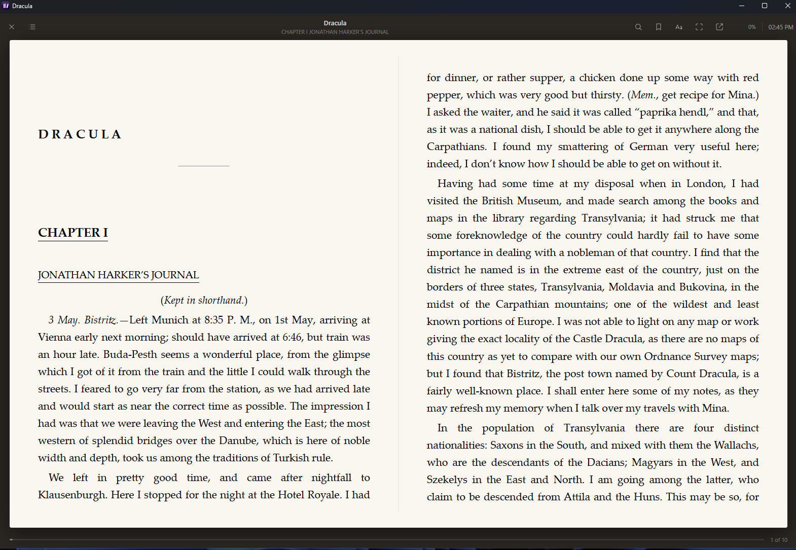
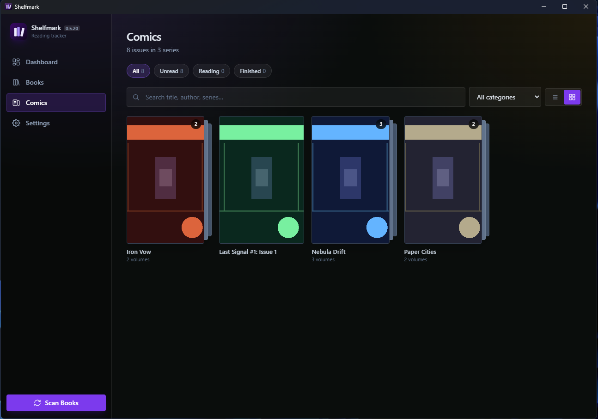
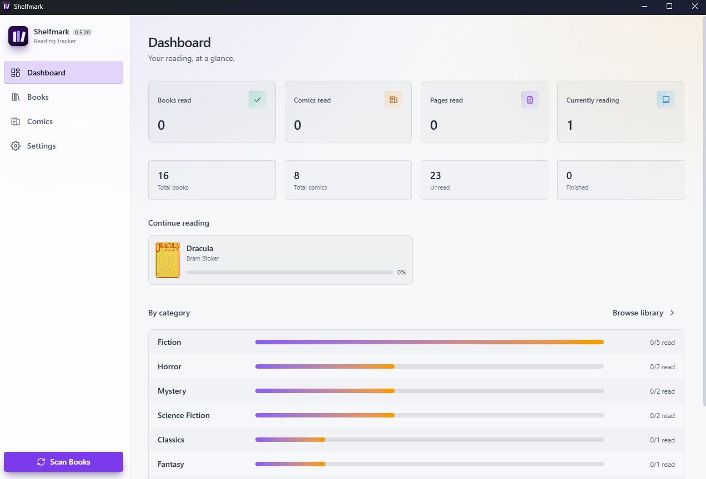
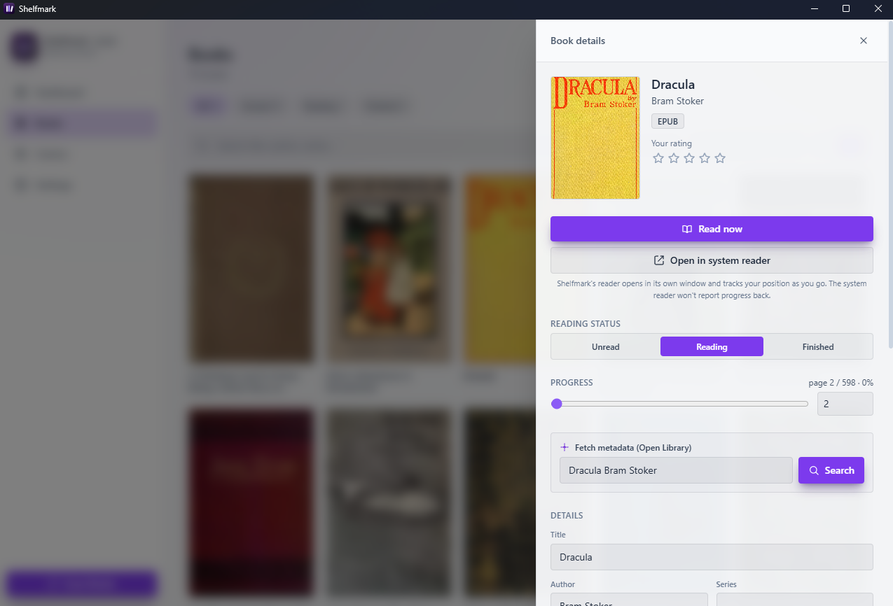

<p align="center">
  
</p>

<p align="center">
  
  
  
  
</p>

Point Shelfmark at your folders and it builds you a proper library: it reads the
metadata out of every ebook and comic, fetches cover art and page counts for
anything missing, reads your EPUBs in a reader of its own, and tracks what
you've finished.

Everything stays on your machine — a single SQLite file and a folder of cached
covers. There's no account, no sync, and no telemetry.

---

## Screenshots

<table>
  <tr>
    <td width="50%" align="center"><b>Library</b> — grid view with covers</td>
    <td width="50%" align="center"><b>Reader</b> — paginated two-page spread</td>
  </tr>
  <tr>
    <td></td>
    <td></td>
  </tr>
  <tr>
    <td align="center"><b>Comics</b> — series grouped on the shelf</td>
    <td align="center"><b>Dashboard</b> — reading at a glance</td>
  </tr>
  <tr>
    <td></td>
    <td></td>
  </tr>
  <tr>
    <td align="center" colspan="2"><b>Book details</b> — metadata, progress, rating, Open Library lookup</td>
  </tr>
  <tr>
    <td colspan="2"></td>
  </tr>
</table>

---

## Features

**Scans your folders, understands the files**
Walks a directory (subfolders included) and indexes every `.epub`, `.pdf`,
`.mobi`, `.azw`, and `.azw3`, reading title, author, publisher, subjects, ISBN,
description and page count out of the file itself. Comics get a folder of their
own, because a comic is often just a PDF and only you know which is which.

**Keeps comics in order**
`.cbz` and `.cbr` sit in a separate Comics section, tagged from `ComicInfo.xml`
where a file carries one. Volumes of the same run collapse into a single shelf
tile that opens to reveal the issues underneath — so a hundred volumes of one
title don't bury everything else. Series names are read from the file's tags or,
failing that, off the filename: `Vol. 3`, `#12`, `v03` and `第100巻` all parse,
and you can always set the series by hand.

**Finds covers, even when the file has none**
EPUB and MOBI covers are lifted straight from the file. PDFs don't carry one, so
the first page is rendered into a cover image instead.

**Fills the gaps online**
Anything still missing can be looked up on [Open Library](https://openlibrary.org) —
cover, page count, subjects, description — from a list of candidate matches. No
API key needed. If nothing matches, type the details in yourself.

**Reads your EPUBs**
A built-in reader opens each book in its own window: paginated two-page spread,
table of contents, and your position remembered to the paragraph. Themes for
paper, sepia and night, with adjustable size, spacing and margins — and a
**Publisher's font** option that leaves the book's own typeface and embedded
fonts exactly as designed.

**Search, highlight and bookmark**
Full-text search across the whole book jumps you to the passage and flags it.
Select any text to highlight it in one of four colours, or drop a bookmark;
both are listed in a side panel that takes you back. Highlights are anchored to
the text itself, so changing the type size or resizing the window never moves
them.

**Or hands them to whatever you already use**
PDFs and comics go straight to your system's default application — YACReader,
SumatraPDF, Preview, whatever you have — and EPUBs can too, from the details
panel. An external reader can't report your position back, so those you mark off
yourself.

**Tracks your reading**
A sortable table — or a cover grid — of everything you own, with reading status,
progress, a 1–5 star rating, and free-text categories with a preset picker.
Reading an EPUB in the built-in reader updates progress on its own; nothing to
type in.

**Shows you the numbers**
A dashboard counting books read, comics read, pages read and what you're
part-way through, plus a breakdown by category. Totals move when you finish
something, so they mean what they say.

## Install

Grab the installer for your platform from the
[latest release](https://github.com/infonality/shelfmark/releases/latest).

| Platform | File |
| --- | --- |
| Windows | `.msi`, or `.exe` (NSIS installer) |
| macOS | `.dmg` (universal — Apple Silicon and Intel) |
| Linux | `.deb`, `.rpm`, or `.AppImage` |

The builds aren't code-signed, so the first launch needs a nudge: on macOS
right-click the app and choose **Open**; on Windows click **More info → Run
anyway**; the AppImage needs `chmod +x` before it will run.

Then open **Settings**, choose the folder your books live in — and a second one
for comics, if you keep them — and hit **Scan**.

## How the metadata works

What can be read from a file varies a lot by format, so Shelfmark takes what it
can get and lets you correct the rest — every field stays editable.

| Format | Metadata | Pages | Cover |
| --- | --- | --- | --- |
| EPUB | Full Dublin Core from the OPF | Estimated | Embedded |
| PDF | Info dictionary | **Exact** page count | First page, rendered |
| MOBI / AZW | EXTH header | Estimated | Embedded when present |
| CBZ | `ComicInfo.xml` when present | **Exact** — one per image | First page |
| CBR | Filename only | — | — |

Pages only count toward your totals once something is marked finished.

CBR is deliberately left unopened. RAR's reference decoder ships under a licence
that can't be vendored into an MIT project, so a `.cbr` is catalogued from its
filename and nothing more. Repack it as a `.cbz` and it gets the full treatment.

Reflowable text has no fixed pages, so the reader stores your position as a spine
index plus a ratio through that chapter rather than a page number — it survives a
font change, a resize, or a switch to a two-column spread. The percentage you see
is derived from character counts taken when the book opens.

> **On Goodreads:** Goodreads retired its public API in 2020 and issues no new
> keys, so there's no supported way to query it. Open Library is the stand-in —
> it's free, needs no credentials, and covers the same ground.

## Building from source

You'll need [Node.js](https://nodejs.org) and the
[Rust toolchain](https://rustup.rs) with Tauri's
[system dependencies](https://tauri.app/start/prerequisites/).

```bash
npm install
npm run tauri dev
```

PDF cover rendering needs the **PDFium** shared library, which is
platform-specific and not checked in. Drop the matching file into `src-tauri/`
(CI does this automatically for releases):

| OS | File | Asset from [pdfium-binaries](https://github.com/bblanchon/pdfium-binaries) |
| --- | --- | --- |
| Windows | `src-tauri/pdfium.dll` | `pdfium-win-x64.tgz` → `bin/pdfium.dll` |
| macOS | `src-tauri/libpdfium.dylib` | `pdfium-mac-univ.tgz` → `lib/libpdfium.dylib` |
| Linux | `src-tauri/libpdfium.so` | `pdfium-linux-x64.tgz` → `lib/libpdfium.so` |

Without it the app still runs; PDFs just fall back to a placeholder cover.

To build an installer for your current OS:

```bash
npm run tauri build
```

Want something to test against? `sample_books/` has a generated EPUB and PDF —
point Settings at it and scan. Regenerate them with
`cd src-tauri && cargo run --example make_sample`.

## Releases

Tauri can't cross-compile, so installers are built in CI on native runners for
each OS. Pushing a version tag builds all three and attaches them to a draft
release:

```bash
git tag v0.1.0 && git push origin v0.1.0
```

To get installers without cutting a release — for testing on a machine you
don't build on — run the workflow manually from the Actions tab. It builds all
three platforms and attaches them to the run as artifacts instead.

## Project layout

```
src/                    React + TypeScript UI
  api.ts                typed wrappers over the Tauri command surface
  ui.tsx                shared primitives (icons, buttons, star rating)
  reader-prefs.ts       themes, typefaces and spacing for the reader
  series.ts             groups comics into series from tags or filenames
  pages/                Dashboard, Library (table/grid + drawer), Settings
    Reader.tsx          paginated reader; Books-style presentation
    ReaderWindow.tsx    host for the standalone reader window
src-tauri/src/
  commands.rs           Tauri IPC boundary
  db.rs                 SQLite schema and queries
  scanner.rs            folder walk, registration, cover refresh
  formats/              epub / pdf / mobi / comic metadata extraction
  reader.rs             spine, contents, sanitising, asset serving
  pdfcover.rs           PDF first-page rendering via PDFium
  metadata.rs           Open Library search and cover download
```

Your library lives in the platform app-data directory — `library.db` plus a
`covers/` folder. Shelfmark never modifies the files themselves.

The bundle identifier is still `com.kas.bookvault`, from when this was called
Book Vault. That string is what picks the app-data directory, so changing it
would strand every existing library. It's invisible to users; leave it be.

## Tests

```bash
cd src-tauri && cargo test
```

## License

[MIT](LICENSE) © Kas
